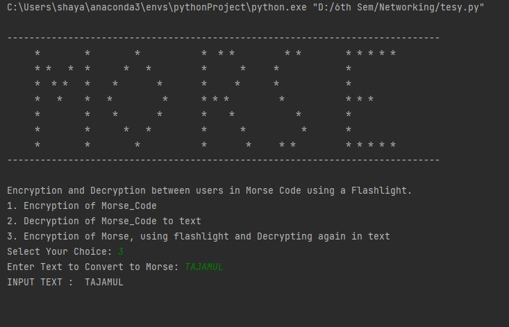

# Encryption-and-Decryption-between-users-in-Morse-using-a-Flashlight.
Morse code has been employed as an assistive technology, helping people with a variety of disabilities to communicate. Morse can be sent by persons with severe motion disabilities, as long as they have some minimal motor control. An original solution to the problem that caretakers have to learn to decode has been an electronic typewriter with the codes written on the keys. Morse code can also be translated by computer and used in a speaking communication aid. An important advantage of Morse code over roCancel changesw column scanning is that once learned, it does not require looking at a display. Also, it appears faster than scanning.

# Morse Code and Flashlight Encryption/Decryption



This Python project allows you to perform encryption and decryption of text using Morse code, as well as a unique feature - encrypting Morse code using a flashlight and then decrypting it back into text. Whether you want to communicate secretly or experiment with Morse code and flashlights, this project has you covered.

## Table of Contents
- [Introduction](#introduction)
- [Features](#features)
- [Requirements](#requirements)
- [Usage](#usage)
  - [Text to Morse](#text-to-morse)
  - [Text to Flashlight Morse and Back to Text](#text-to-flashlight-morse-and-back-to-text)
  - [Morse to Text](#morse-to-text)
- [Contributing](#contributing)
- [License](#license)

## Introduction

Morse code is a fascinating way to encode and decode text using a series of dots and dashes. This project provides functionality for text-to-Morse and Morse-to-text conversion. It also includes a unique feature that allows you to convert text to Morse code and then blink it using a flashlight. The blinking Morse code can be decrypted back into text.

## Features

- Text-to-Morse code conversion.
- Morse code-to-text conversion.
- Encryption of Morse code using a flashlight.
- Decryption of flashlight-encoded Morse code back into text.

## Requirements

Before using this project, ensure you have the following dependencies installed:

- Python (>= 3.6)

## Usage

### Text to Morse

You can convert text to Morse code using the following function:

```python
Text_to_Morse()
